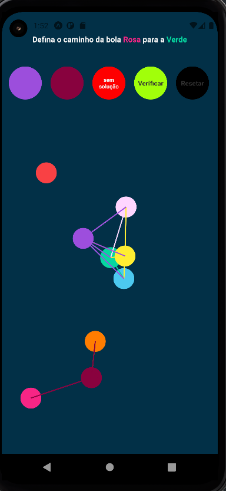
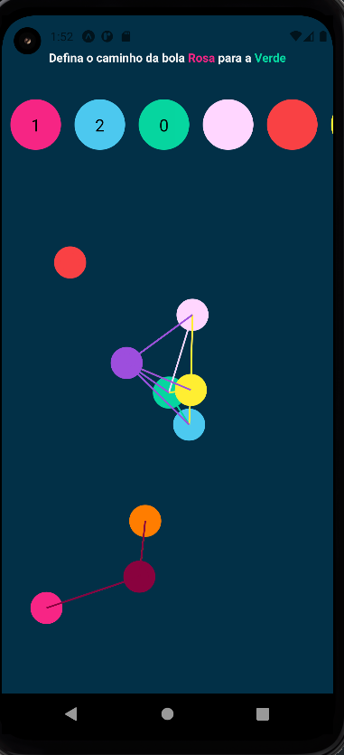
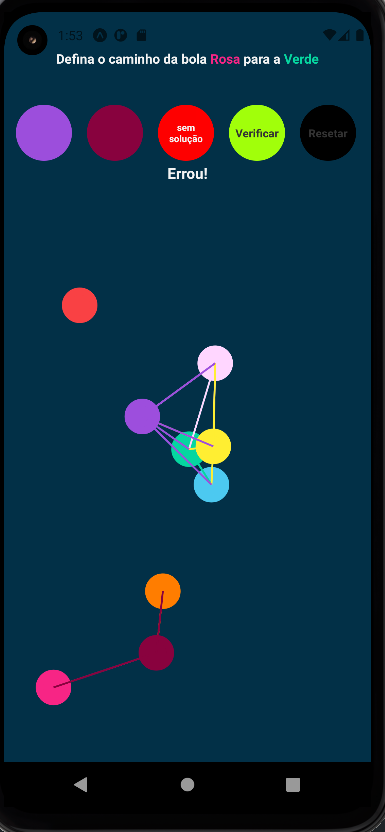

# NomedoProjeto

**Conteúdo da Disciplina**: Grafos 2 

## Alunos

| Matrícula  | Aluno        |
| ---------- | ------------ |
| 19/0024950 | Arthur Melo  |
| 18/0105604 | Luis Marques |

## Sobre

O projeto consiste num aplicativo onde o usuário escolhe qual vai ser o melhor caminho para interligar os prédios,ajude o homem aranha a entregar a sua pizza no local desejado.
O algoritmo faz a validação utilizando Dijkstra.

A apresentação do projeto se encontra [Aqui](/Apresentacao.mp4)

## Screenshots
Entre no jogo. Os bolinhas e as restas correspondem os caminhos possíveis de uma cor a outra

Clique nas opções acima para percorrer o menor de caminho da bola rosa até a bola verda

Em seguida arreste para o lado e submeta para ver o resultado

## Instalação

**Linguagem**: JavaScrypt 
**Framework**: React,Native,Expo 

Descreva os pré-requisitos para rodar o seu projeto e os comandos necessários.

### Requisitos de instalação:

    -  Aparelho Android 8.0 ou superior

Para a instalação baste executar o comando:

    - expo start a
